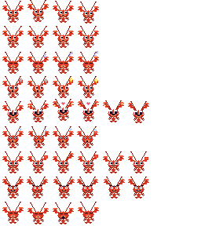

# Desktop Pet 🦞

像素风龙虾桌面宠物，集成 AI 对话能力。

小龙虾在桌面安静待着（呼吸、环顾、睡觉等 idle 动画），单击 poke 会随机做出反应（开心、生气、懒洋洋等），双击弹出对话框进行 AI 对话。对话过程中龙虾会实时反应 — 思考中亮灯泡、收到回复开心跳、出错则困惑转圈。

角色和 AI 后端均通过配置文件驱动，无需改代码即可替换。

## 预览



## 功能特性

- **像素风龙虾** — 9 种动画状态，每种多帧动画，配置驱动
- **智能交互** — 单击 poke（随机反应）/ 双击打开聊天
- **AI 对话集成** — 流式输出，逐字显示，Markdown 渲染
- **宠物反应** — 对话状态自动驱动动画切换
- **可拖拽** — 拖动龙虾到桌面任意位置，位置自动持久化
- **系统托盘** — 托盘图标 + 右键菜单（Show Pet / Open Chat / Quit）
- **始终置顶** — 透明窗口，所有桌面空间可见
- **配置驱动** — 角色通过 `sprite-meta.json` 定义，AI 后端通过 `ai-provider.json` 配置

## 技术栈

| 项目 | 选择 |
|------|------|
| 桌面框架 | Tauri v2 (Rust + WebView) |
| 前端 | React 18 + TypeScript + Vite |
| 渲染 | 像素风 sprite sheet + Canvas (`imageSmoothingEnabled = false`) |
| AI 集成 | 可配置的 CLI spawn + Tauri Channel 流式推送 |
| 平台 | macOS（需要 `macos-private-api` 实现透明窗口） |

## 架构

```
┌──────────────────────────────────────────────────┐
│                   Tauri App                      │
│                                                  │
│  Pet Window              Chat Window             │
│  (透明/置顶)    Events   (按需显示)              │
│  Canvas 动画  ◄────────  消息列表 + 输入          │
│       │                       │                  │
│       ▼                       ▼                  │
│  sprite-meta.json      ai-provider.json          │
│  (角色/动画定义)        (AI 后端配置)             │
│                                                  │
│  ┌──────────────────────────────────────────┐    │
│  │            Rust Backend                  │    │
│  │  spawn AI CLI (allowlist 校验)           │    │
│  │  stream-json 解析 → Channel 推送         │    │
│  │  窗口管理 / 系统托盘                     │    │
│  └──────────────────────────────────────────┘    │
└──────────────────────────────────────────────────┘
```

> 详细架构文档见 [docs/architecture.md](docs/architecture.md)

## 快速开始

### 前置条件

- [Rust](https://rustup.rs/) (1.70+)
- [Node.js](https://nodejs.org/) (18+)
- [Claude Code CLI](https://docs.anthropic.com/en/docs/claude-code) — 需要在 PATH 中可用（或配置其他 AI CLI）
- macOS（透明窗口依赖 macOS 私有 API）

### 安装与运行

```bash
# 安装依赖
npm install

# 开发模式
npm run tauri dev

# 打包
npm run tauri build
```

### 重新生成 Spritesheet

```bash
node scripts/generate-spritesheet.cjs
```

## 项目结构

```
desktop-pet/
  public/
    sprites/
      spritesheet.png        # 像素风龙虾精灵图 (256×288, 32×32 per frame)
      sprite-meta.json        # 角色定义 + 帧动画元数据 + category 分类
    ai-provider.json          # AI 后端配置 (binary/args/displayName/installUrl)
  scripts/
    generate-spritesheet.cjs  # 纯 Node.js 生成像素龙虾 spritesheet
  src/
    main.tsx                  # React Router 入口 (/pet, /chat)
    shared/types.ts           # 共享类型 (PetState, SpriteMeta, AIStreamEvent, AIProviderConfig)
    pet/                      # 宠物窗口
      PetWindow.tsx           # 主组件 (拖拽 + 单击poke + 双击聊天)
      PetSprite.tsx           # Canvas 渲染器 (尺寸从 meta 读取)
      useSpriteAnimation.ts   # 帧动画 hook (rAF + 动态 scale)
      useAnimationState.ts    # 状态机 (idle循环/sleep超时/跨窗口事件)
      petAnimations.ts        # 动画工具函数 (从 meta 动态派生)
    chat/                     # 聊天窗口
      ChatWindow.tsx          # 主组件 (AI 可用性检测 + 动态品牌字符串)
      ChatInput.tsx           # 输入框 + 发送按钮
      ChatMessages.tsx        # 消息列表 (Markdown渲染 + 流式光标)
      useAIChat.ts            # 加载 provider 配置 + Tauri Channel 流式接收
  src-tauri/
    src/
      lib.rs                  # Tauri 入口 (插件注册 + 系统托盘)
      commands/
        ai.rs                 # spawn AI CLI (allowlist 校验) + stream-json → Channel
        window.rs             # 窗口控制 (toggle_chat, set_click_through)
    tauri.conf.json           # 双窗口配置, macOSPrivateApi
  docs/
    architecture.md           # 详细技术架构文档
```

## 配置驱动

### 角色配置 — `sprite-meta.json`

动画通过 `category` 字段驱动行为逻辑：

| Category | 行为 |
|----------|------|
| `idle` | 自动循环（8s 切换） |
| `sleep` | 60s 无操作后触发 |
| `poke` | 单击随机触发，播放一次 |
| `greet` | 双击触发 |
| `reaction` | AI 对话状态驱动（如 thinking） |

添加新动画：在 JSON 加一行 + spritesheet 加对应行，零代码改动。

### AI 后端配置 — `ai-provider.json`

配置 AI CLI 的 binary、参数、环境变量、显示名等。修改 `displayName` 即可更新全部 UI 品牌字符串。

## 龙虾状态

| 状态 | 触发条件 | Category | 动画效果 |
|------|---------|----------|---------|
| idle-breathe | 默认 | idle | 微微弹跳，钳子跟随 |
| idle-look | 8s 自动切换 | idle | 眼睛左右看，触须摆动 |
| idle-sleep | 60s 无操作 | sleep | 闭眼 + Zzz 气泡 |
| wave | 双击宠物 | greet | 右钳挥动打招呼 |
| happy | 单击 poke / 收到回复 | poke | 弹跳 + 星星 + 爱心 |
| angry | 单击 poke | poke | V 形怒眉 + 身体抖动 + 蒸汽 |
| lazy | 单击 poke | poke | 闭眼 + 打哈欠 + 身体下沉 |
| confused | 单击 poke / 出错 | poke | 螺旋眼 + 问号 |
| thinking | 发送消息 | reaction | 眼睛转动 + 灯泡亮起 |

## License

MIT
